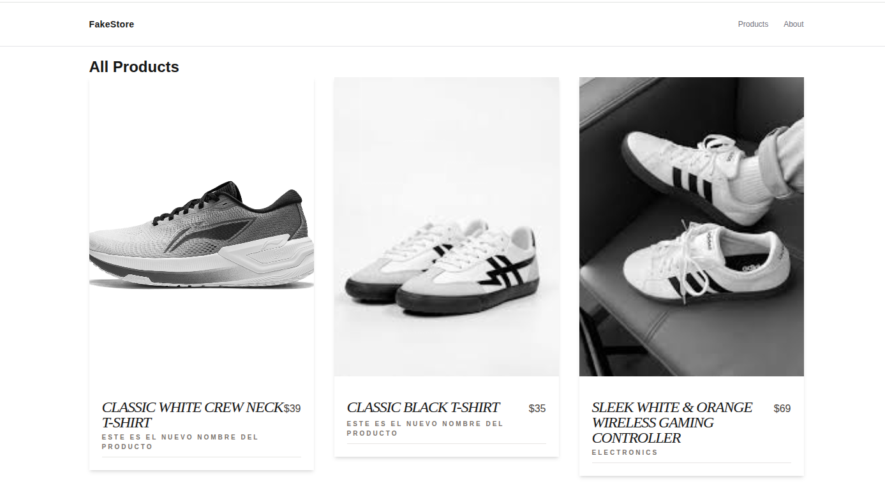
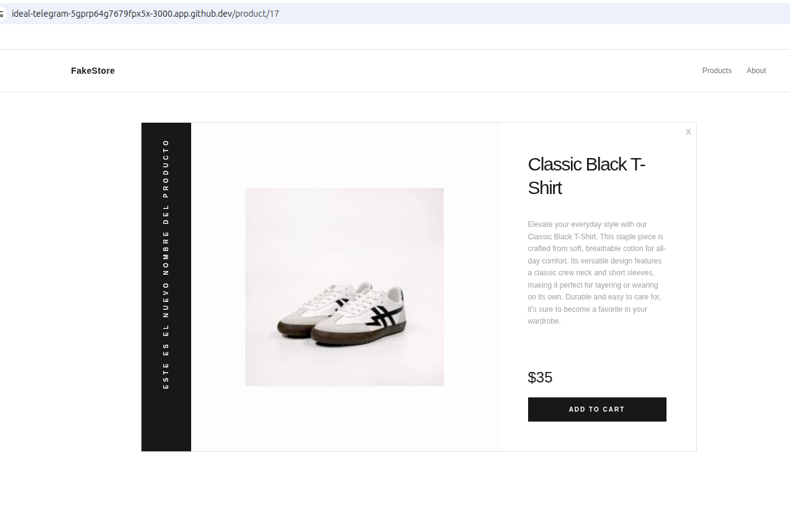
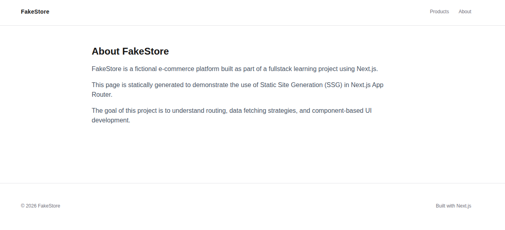
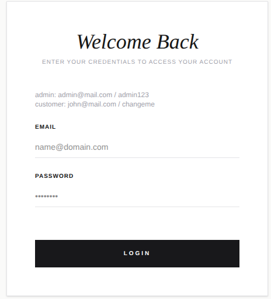
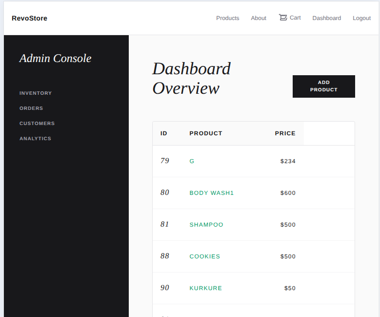
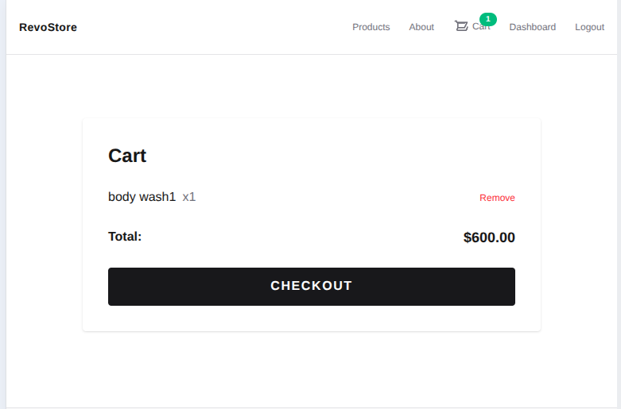

[](https://classroom.github.com/a/2EJ5Xvqu)

# FakeStore - Next.js Products Listing & Routing Demo
This project demonstrates core Next.js concepts such as routing, data fetching strategies (CSR, SSR, SSG), and component-based UI development, authentication & authorization using proxy.

### Live Demo
**Vercel** [click here](https://milestone-3-rahmat-bagus-santoso.vercel.app/)

## Features
- Product Listing page (Home)
- Product detail page with dynamic routing
- Client-side rendering (CSR) for product listing
- Server-side rendering (SSR) for product detail
- Static site generation (SSG) for static page
- login for admin/customer
- cart

## Improvements

- Implemented **server-side role-based authorization** for protected CRUD API routes (POST, PUT, DELETE).
- Added **request validation using Zod** to ensure required fields, types, and value constraints at the API layer.
- Added **unit tests for cart store and CRUD API routes** to ensure correct behavior and security handling.
- Improved API robustness and test coverage across product management features.

## Tech Stack
- Next.js (App Router)
- TypeScript
- Tailwind CSS
- FakeStore API (Platzi - EscuelaJS)

## Project Structure
```
.
src/
 ├── app/
 │    ├── page.tsx
 │    ├── about/
 │    │     └── page.tsx
 │    │
 │    ├── admin/
 │    │      └── page.tsx
 │    │
 │    ├── api/
 │    │     ├── products/[id]
 │    │     │             ├── route.ts
 │    │     │              └── route.test.ts
 │    │     ├── route.ts
 │    │     └── route.test.ts
 │    │
 │    ├── cart
 │    │     └── page.tsx
 │    │
 │    ├── checkout/
 │    │      └── page.tsx
 │    │
 │    ├── login/
 │    │     └── page.tsx
 │    │
 │    └── product/[id]/
 │                 └── page.tsx
 │
 ├── components/
 │       ├── Footer.tsx
 │       ├── Header.tsx
 │       ├── ProductCard.tsx
 │       └── ProductGrid.tsx
 │
 ├── lib/
 │    ├── api.ts
 │    ├── auth.ts
 │    ├── auth.test.ts
 │    ├── auth-types.ts
 │    ├── product-schema.ts
 │    └── require-admin.ts
 │    
 ├── types/
 │    └── product.ts
 │ 
 ├── store/
 │      ├── auth-store.ts
 │      ├── cart-store.ts
 │      └── cart-store.test.ts
 │
 ├── proxy.ts 
 └── Readme.md


```
## Tools Used
- **Framework:** Next.Js
- **Styling:** Tailwind CSS
- **Language:** Typescript
- **Development Environment:** Github Codespaces
- **Development Assistance:** ChatGPT

## Screenshots








## Getting Started
```
npm run install
npm run dev

```
